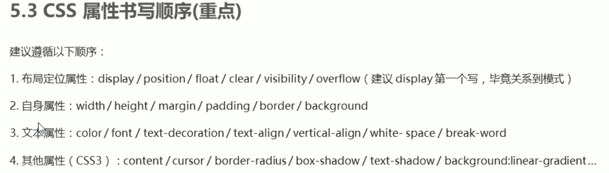

# CSS基础



## init

```css

body,p,h1,h2,h3,h4,h5,h6,ul,ol,dl,li,dt,dd {
    margin: 0;
    padding: 0;
    list-style: none;
    font-size: 16px;
    font-family: "Microsift YaHei";
}

input,img {
    margin: 0;
    padding: 0;
    border: 0 none;
    outline-style: none;
}

a {
    text-decoration: none;
    color: #000;
}

```

## Emmet语法

快速输入

- .className : 快速新建一个类名为__的标签
- #idName : 快速新建一个id为__的标签
- div>div : 快速新建父子元素
- div+div : 快速新建兄弟元素
- div*10 : 快速新建多个相同元素
- div.divClass$*10 : 编号自动增加
- div{这是div内的文本}*10 : 往标签内写内容

## CSS 的元素显示模式

### 块元素

常见元素
`p`, `h1~6`, `div`...

1. 独占一行
1. 高度、宽度、外边距、内边距都可以控制
1. 宽度默认尽可能的大
1. 是一个容器及盒子，里面可以放行内或块级元素

tips:

- 文字类的元素内不能放块级元素（`<p>`, `<h1~h6>`）

### 行内元素

常见元素
`a`, `strong`, `b`, `em`, `i`, `del`, `s`, `ins`, `u`, `span`...

1. 设置宽度、高度 无效
1. 只能容纳文本或其他行内元素
1. 可以把行内元素当成文本，例如在使它居中时可以给其父元素设置`text-align:center;`

tips:

- `a`中可以放块级元素，但最好转换成块级元素更安全

### 行内块元素

常见元素
`img`, `input`, `td`...

- 一行可以放多个行内块元素，之间有空白缝隙
- 高度、宽度、边距都可以控制

### 显示模式转化

```html
.oneClass {
    display:block; <!-- 行内元素转块级元素 -->
    display:inline; <!-- 块级元素转行内元素 -->
    display:inline-block; <!-- 行内元素转换行内块元素 -->
}
```

## CSS代码的位置

### 行内样式表（内联样式表）

- 行内式
- 权重高

```html
<div style="color: pink; font-size:20px; ">hello</div>
```

### 内部样式表

- 内联式

```html
<style>
    <!-- CSS 样式 -->
</style>
```

### 外部样式表

- 外链式、链接式引入
- 完全实现结构和样式分离

```html
<link rel="stylesheet" href="/* CSS文件路径 */">
```

## CSS基础选择器

### 标签选择器

### 类选择器

一个类可以被多个标签使用，
而且一个标签也可以同时使用多个类，
可以抽离不同类中的公共部分，简化代码。

### id选择器

只能调用一次，后面再调用就失效了。

## CSS复合选择器

### 后代选择器

```html
ul li {<!-- 样式声明 -->}
```

### 子元素选择器

```html
ul > li {<!-- 样式声明 -->}
```

### 并集选择器

```html
h1, p {<!-- 样式声明 -->}
```

### 伪类选择器

- 前面用 `:`，表示伪类选择器
- 常用
    1. `:link`
    1. `:visited`
    1. `:hover`
    1. `:active`
    1. `:focus` : 焦点，主要针对input

```html
a:link {<!-- 样式声明 -->}
input:focus {
    background-color: red;
}
```

## 字体属性

1. `font-family`: 字体
1. `font-size`: 字体大小
    - 默认普通字体的大小为16px
1. `font-weight`: 字体粗细 范围（100~900）
    - `normal`: 正常 等同于400
    - `bold`: 加粗 等同于700
    - ...
1. `font-style`: 文字样式
    - `normal`: 正常的
    - `italic`: 斜体的
1. `line-height`: 行高
1. `font`: 复合属性
    顺序: font: [font-style font-weight ] font-size/line-height font-family;

## 文本属性

1. `color`: 文本颜色
    - `red`: 直接使用预设的颜色单词
    - `#ff0000`: 16进制颜色代码
    - `rgb(255,0,0)`: 10进制rgb
1. `text-align`: 文本（水平）对齐
    - `left`: default
    - `center`
    - `right`
1. `text-decoration`: 装饰文本
    - `none`: 没有效果，清除`a`标签的下划线
    - `underline`: 下划线
    - `overline`: 上划线
    - `line-through`: 删除线
1. `text-indent`: 首行缩进
1. `line-height`: 行间距，文字高度+上下空白区域
    - `line-height`更改的是整行的屬性，并不局限于自身的盒子，因此在它后面的被转换成`inline-block`的元素会错位

## 背景

1. `background-color`
    - `transparent`（默认）: 透明的
    - 颜色代码
1. `background-iamge`: 背景图片，背景图片会压住背景颜色，如果蹄片是透明的就能显示背景颜色
    - none（默认）
    - url(图片地址)
1. `background-repeat`: 背景平铺
    - `repeat`（默认）: 平铺
    - `no-repeat`: 不平铺
    - `repeat-x`: X轴平铺
    - `repeat-y`: Y轴平铺
1. `background-position`: 背景图片的位置
    - `x y`
        1. 方位名词：left, right, top, bottom, center
        1. 精确单位，距离左边、距离右边
        1. 混合单位
1. `background-attachment`: 背景固定
    - `scroll`（默认）: 滚动
    - `fixed`: 固定
1. `background`: 简写，没有顺序要求

## CSS 三大特性

1. 层叠性
1. 继承性
1. 优先级 (0,0,0,0)
    - !important(无穷大) > inline(1,0,0,0) > id(0,1,0,0) > class(0,0,1,0) > element(0,0,0,1) > *(0,0,0,0)
    - 权重叠加
    - 权重叠加不会进位

## 盒子模型

组成

1. `content`
1. `padding`
1. `border`
1. `margin`

### 边框

- `border-width`
- `border-style`
    1. `none`
    1. `dashed` 虚线
    1. `dotted` 点线
    1. `solid`
    1. `double`
    1. ...
- `border-color`
- `border`: 简写，顺序无所谓
- ...: 上下左右，都可以分开来写：分标签写、一个标签多个值
- `border-collapse`: 边框合并
    1. `collapse`
- `border-radius`: 圆角边框

### 边距

- margin: 当父元素内子元素设置margin后，父元素会存在外边距塌陷的问题。
    例如：

    ```css
    father {
        margin-top: 10px;
    }
    son {
        margin-top: 20px;
    }
    ```

    此时father会与上面其它元素形成20px的距离。
    解决方式：
        1. 给父元素设置border，挡住子元素
        2. 给父元素设置`overflow: hidden`
        3. 给父元素定义上内边距

### 其它

1. `border-shadow`: 盒子阴影
    - `x偏移 y偏移 模糊距离 阴影尺寸 阴影颜色 [内阴影(inset)/外阴影(outset)默认。但不能写出来]`
1. `text-shadow`: 文字阴影
    - 只有内部阴影

## 浮动

### float的属性

- none
- left
- right

### float特性

1. 浮动元素脱离标准流
1. 具有行内块元素特性
1. 浮动元素不会对前面的标准流产生影响

### 清除浮动

父盒子不方便给高度时，为了避免浮动对父元素的浮动，需要使用清除浮动。

方法

1. 额外标签法
    - 父元素最后添加一个空块级元素，给`clear: both`属性
1. 父级添加overflow属性
    - 父元素添加`overflow:hidden/auto/scroll`
1. 父级添加alter伪元素

    ```css
    .clearfix:after {
        content: "";
        display: block;
        clear: both;
        <!-- 只用上三个就能实现效果 -->
        height: 0;
        visibility: hidden;
    }
    ```

1. 父级添加双伪元素

    ```css
    .clearfix:before,
    .clearfix:after {
        content: "";
        display: table;
    }
    ```

## 定位

定位 = 定位模式 + 偏移量

### 定位模式

`position`

1. `static` : 静态定位
    - 默认，相当于没有定位
1. `relative` : 相对定位
    - 相对于自己原来的位置
    - 原有的位置仍然保留
1. `absolute` : 绝对定位
    - 不占有位置
    - 要依靠最近的有定位的祖先元素
1. `fix` : 固定定位
1. `sticky`: 粘性定位

### 边偏移

1. `top`
1. `bottom`
1. `left`
1. `right`

## 其他

叠放次序：z-index
