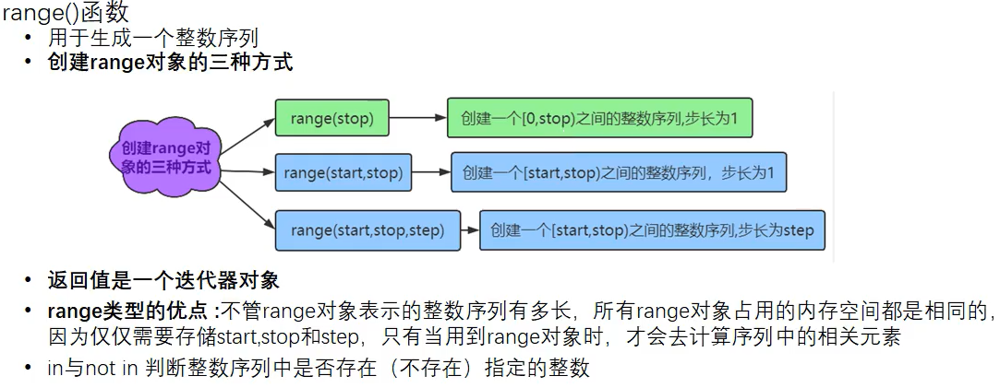
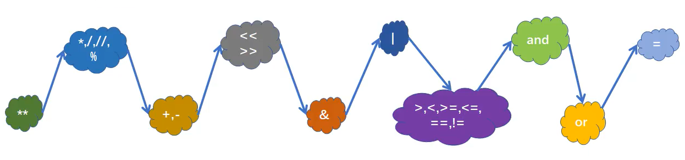

# Python笔记

python 一切皆对象

## 注释

- Python注释 以`# `标记
```python
    # 单行注释
```
- 多行注释
```python
"""
多行注释，用三个双引号
"""
'''
也可以这样
'''
```

## 换行

```python
c='你'\
'好'\
'呀!'
```

## 分支
- if
    ```python
    a=1
    b=2
    # --------另一种方式------------
    if a>b:
    	print(a)
    elif a==b:
        print('a==b')
    else:
    	print(b)
    print("hello")
    ```

## 循环

### 循环的配件

-   else 也可以与for，while连用

    -   属于循环的一部分
    -   当循环结束后会执行

    ```python
    for i in range(10):
        if i == 7:
            break
        else:
            print(i)
    else:
        print('此时else 不会 执行')
    ```

-   range()

    - 左闭右开
	- 

### 循环

- for-in
    ```python
    for item in range(10)
	    print(i)
    ```

- while
    ```python
    while True:
        print('Hello')
    ```

## 数据类型

1. 整型（123）
2. 浮点型（1.0）
3. 复数（a+bi）
4. 布尔类型（true/false）
5. 字符串

## 优先级

1.  ()
2.  算数
    1.   幂
    2.  乘除
    3.  加减
3.  位运算
    1.  左移右移
    2.  &
    3.  |
4.  比较
5.  Bool
    1.  and
    2.  or
6.  =



​        
