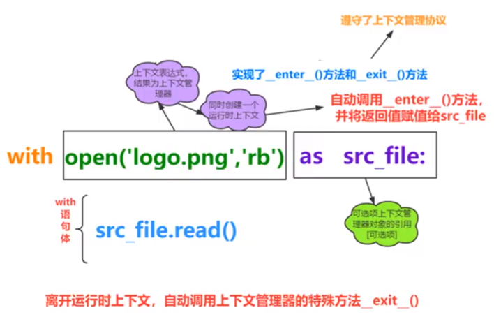

# with 上下文管理器





怎样使上下文管理器对自己的类有效：

```python
class MyContextMgr:
    def __enter__(self):
		print('enter')
    def __exit__(self, exc_type, exc_val, exc_tb):
        print('exit')
    def show(self):
        print('show')

with MyContextMgr() as m:
    m.show()

'''结果
enter
show
exit
'''
```

