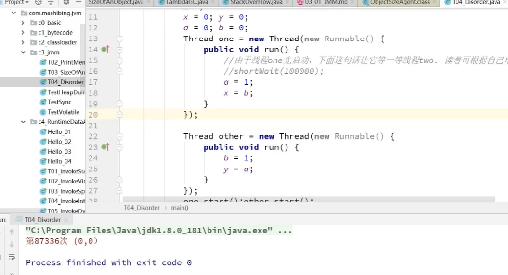
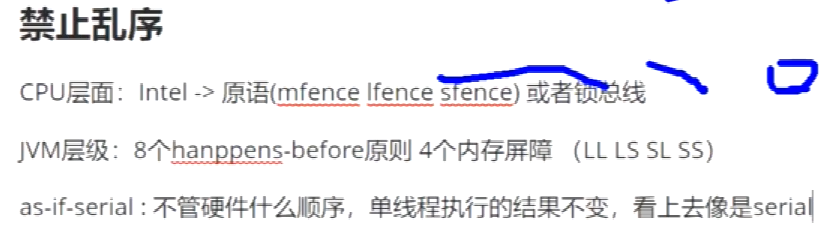
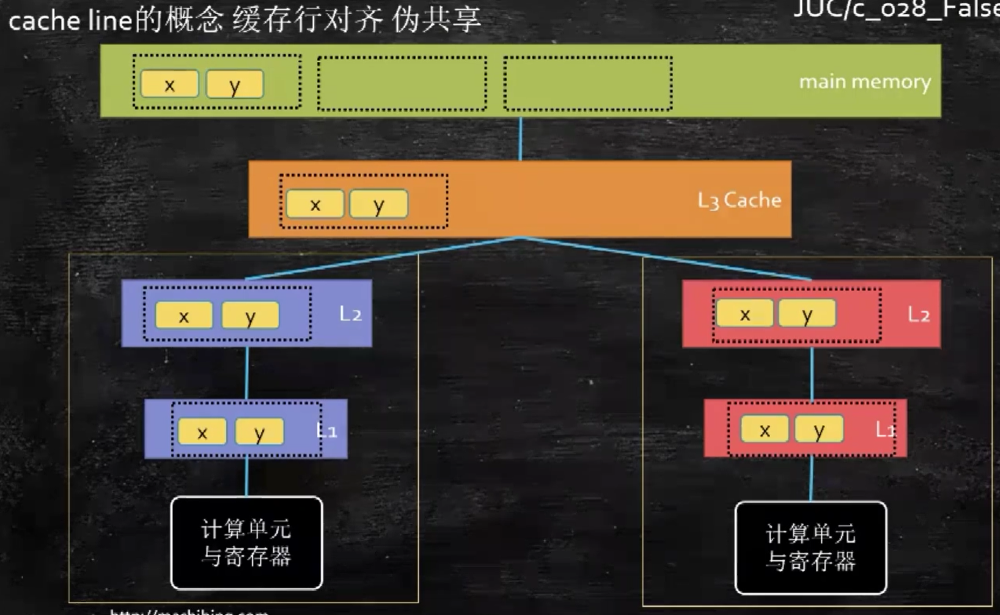
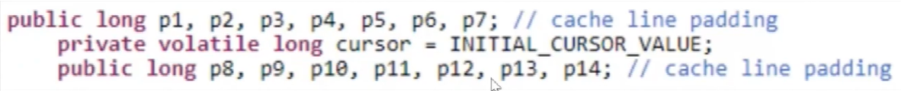

# CPU

## 组成

- PC -> Program Counter 程序计数器
- Registers
- ALU
- CU -> Control Unit 控制单元
- MMU -> Memory Management Unit 内存管理单元
- cache

## 核,线程

- 单核单线程
  - 一个CPU一个内核
- 单核多线程
  - 一个CPU多个内核
- 多核多线程
  - 多个CPU多个内核
- 超线程
  - 单个CPU的单个内核上添加PC(程序计数器),寄存器组并与原来的一起工作,充分利用ALU(运算逻辑单元)

## 指令重排序(乱序执行)

提高CPU的执行效率，对单线程没有副作用
但！在多线程中如果因为这个而出现了BUG,一般情况下是很难发现的！

如上图所示，这个程序执行了87336次才出现了一次指令重排序

如何在特定时期阻止CPU的乱序执行？
C++ => 通过一个汇编层的命令实现
Java => [volatile](https://www.cnblogs.com/zhengbin/p/5654805.html)声明 （通过内存屏障实现）

[volatile文章2](https://www.cnblogs.com/dolphin0520/p/3920373.html)

## 缓存行（cache line）

一个缓存行64个字节，也就是64 * 8 byte

### 缓存一致性协议

MESI（inter CPU采用此协议）

缓存行的四种状态：

- Modified：被修改了
- Exclusive：独享
- Shared：共享，只读
- Invalid：失效

硬件上用缓存锁通知其他CPU内核

### 缓存行对齐

应对缓存行而产生的一些编码方式——实现对多进程共享的数据加速处理

以上程序，无论如何读取cursor到缓存行都要读入一些*填充数据*，从而使得缓存行的64字节中只有一个有效的数据，从而避免cpu内核之间因数据修改的相互通信，节省时间

