# 操作系统基本原理

## 概述

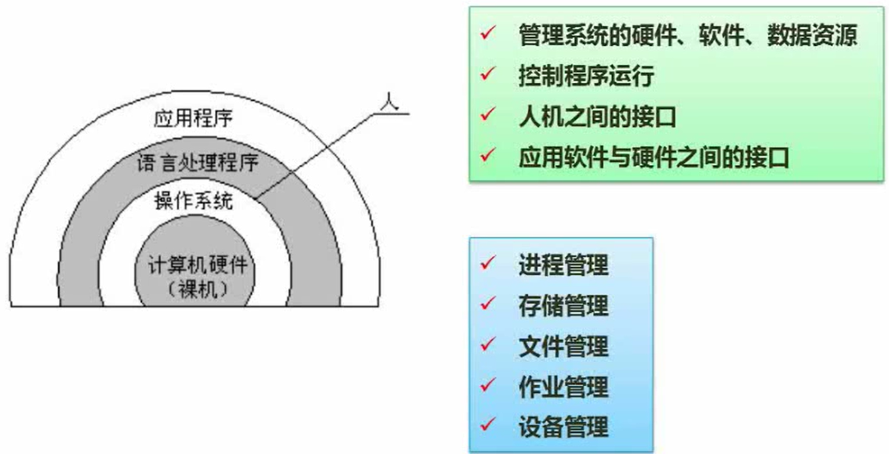

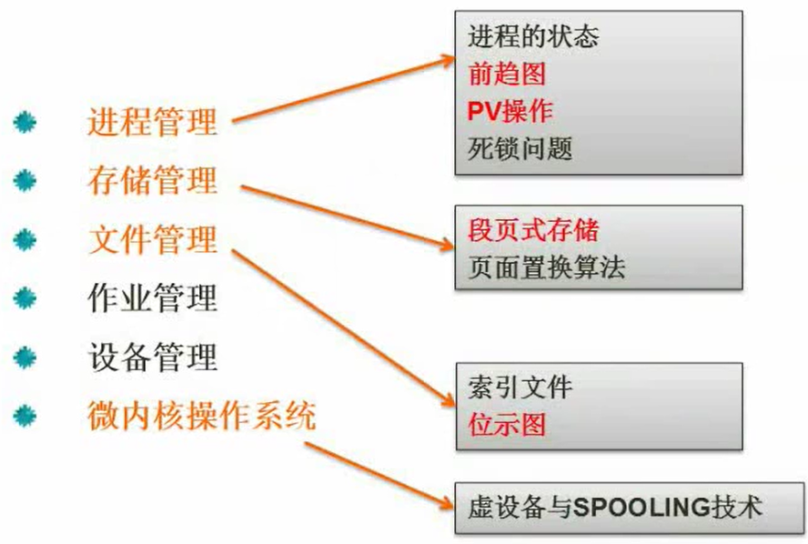

## 进程管理

### 进程的状态

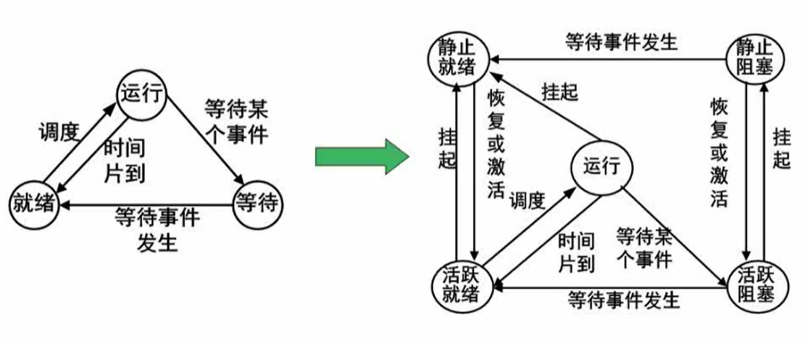

### ==前驱图==

-   可以知道哪一些操作可以同步进行,以及操作的顺序

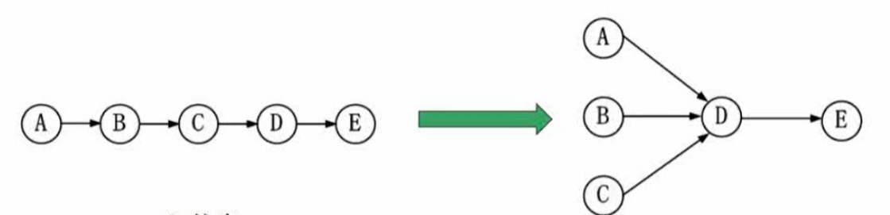

### 进程的同步与互斥

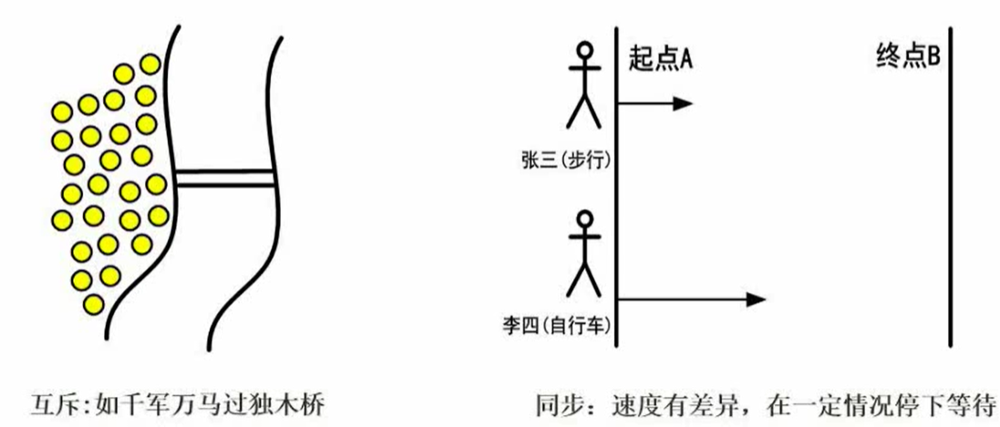

互斥:不能同时使用资源
同步:可以同时使用资源

### ==PV操作==

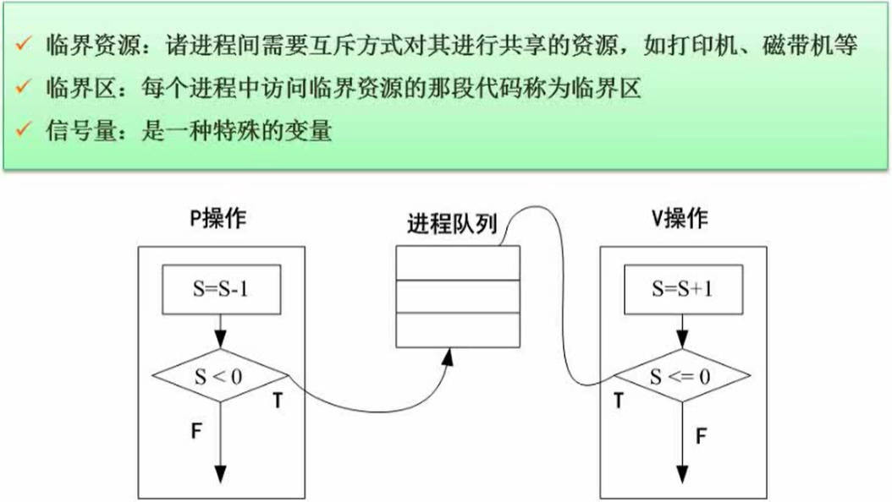

P 为 阻塞、加锁，当信号量不足是阻塞进程
V 为 唤醒、解锁，当信号量充足是唤起进程

==PV操作以及这里学的,不少东西都是一种思维方式,要认真学!!!==

### 进程的死锁问题

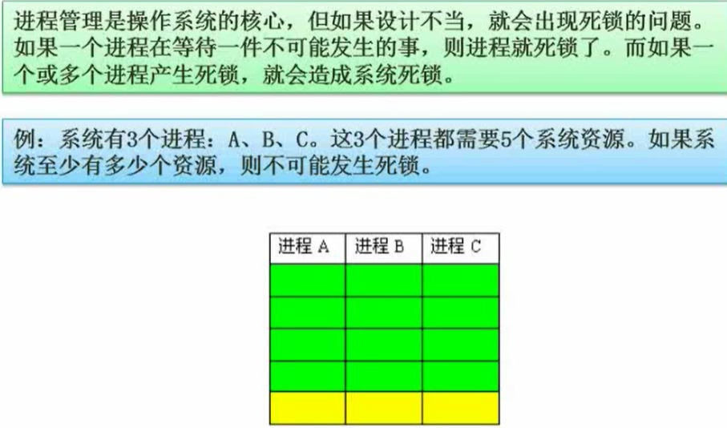

最少：  5个 // 一个一个完成
最多：13个 // 所有的都一起做，都差一个，再加一

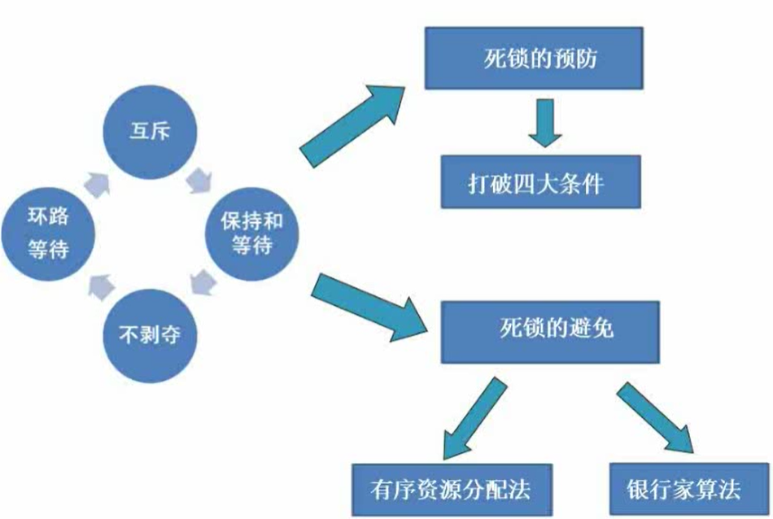

有序资源分配法：资源的利用率比较低

银行家算法：分配资源的原则（放贷）

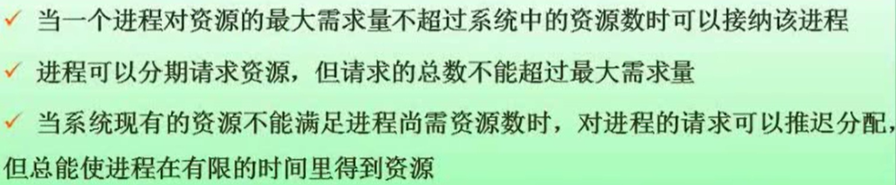

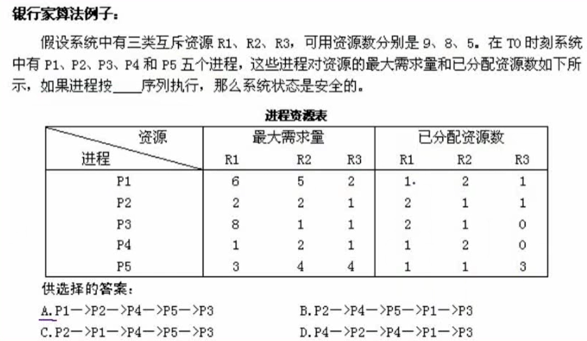
答案：B
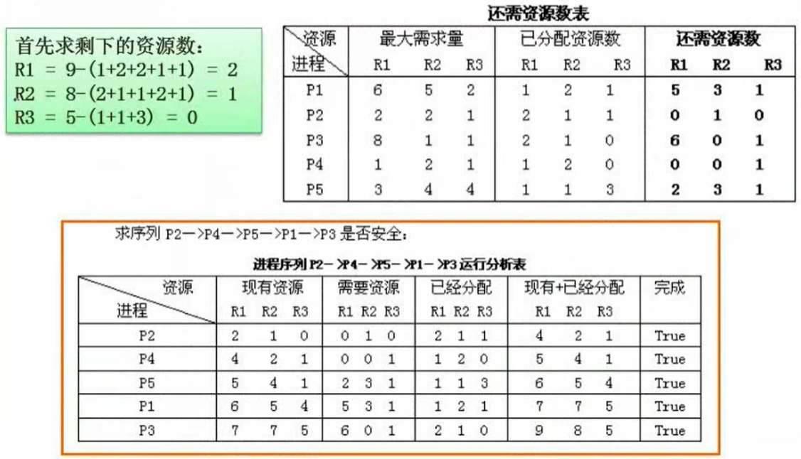

## 存储管理

### 分区存储组织

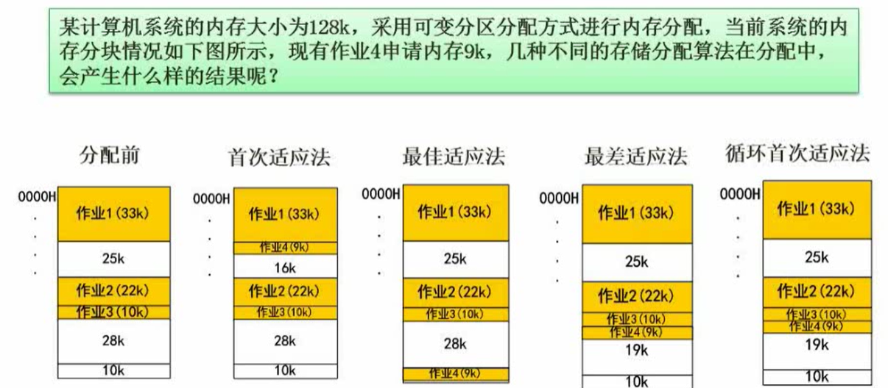

最佳适应算法缺点：会产生大量的碎片

### ==段页式存储==

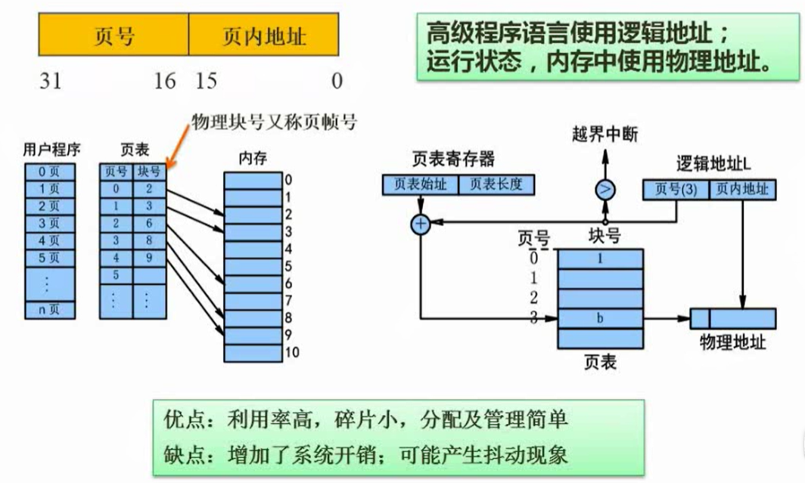

#### ==页面置换算法==

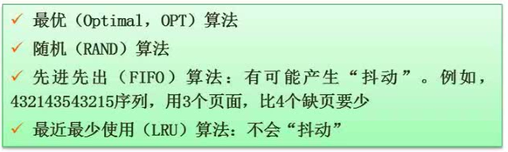

最优算法：只是满分参考而已，用来给其他算法打分，就是一个马后炮
随机算法：随即淘汰一个页，性能也是随机的
FIFO：可能会产生抖动
LRU

抖动：给的资源多了，但是性能更差了
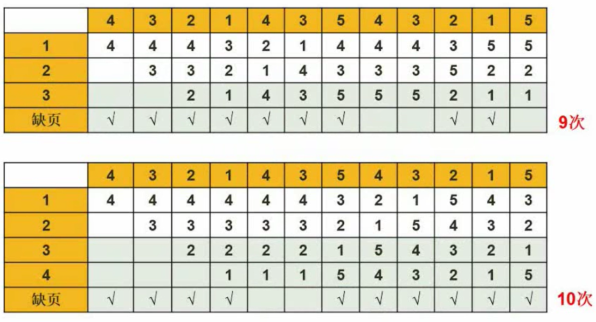

FIFO与LRU的比较：

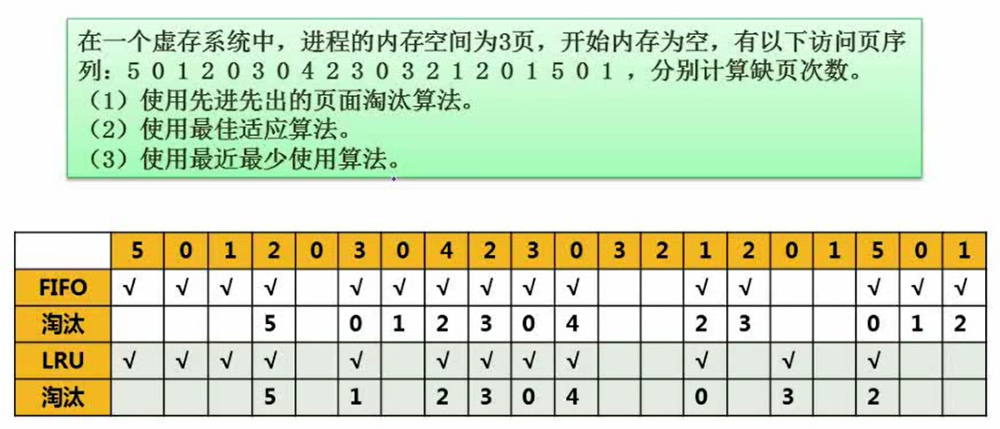

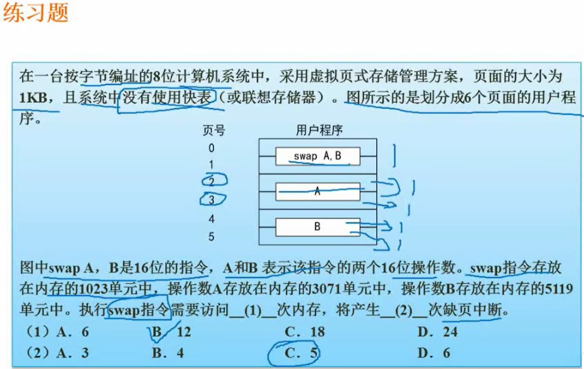

## 文件管理

### ==索引文件结构==

### 文件和树形目录结构

### ==空闲存储空间的管理==

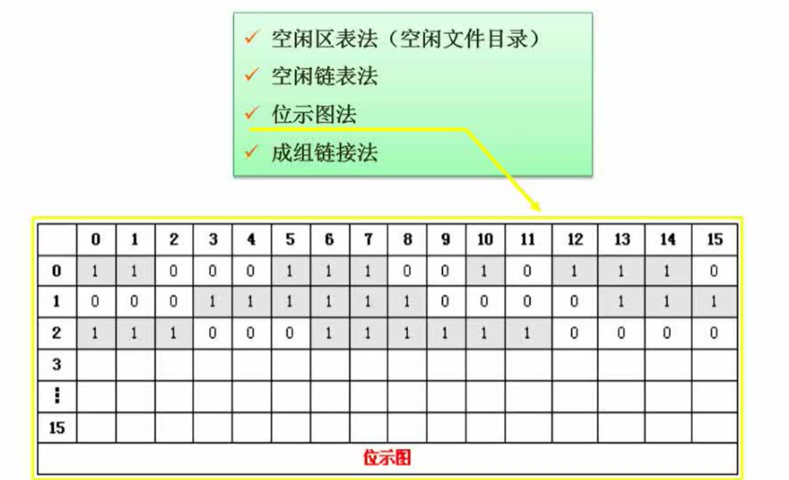

## 作业管理

## 设备管理

### 虚设备与SPOOLING技术

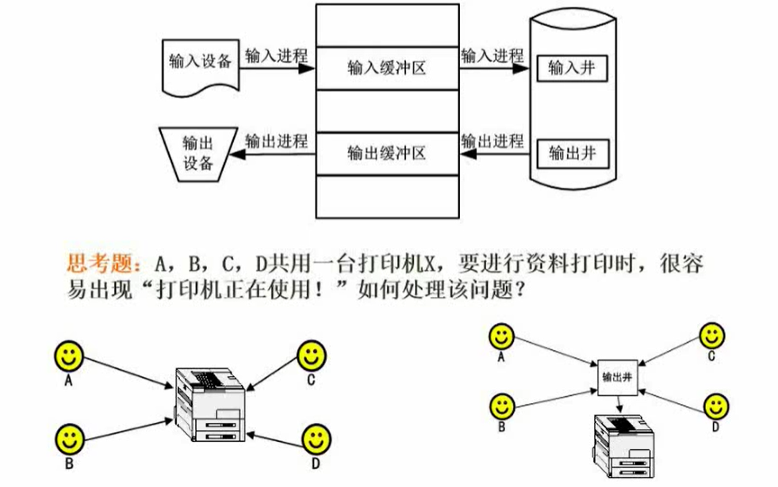

## 微内核操作系统

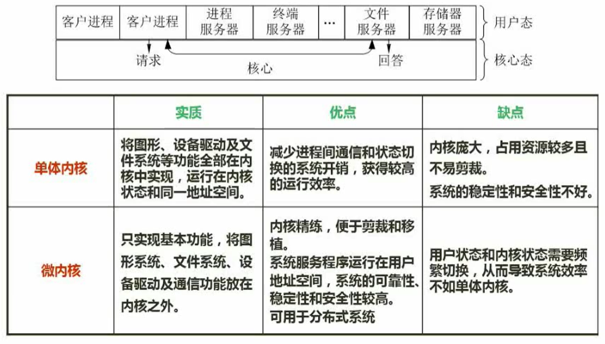

