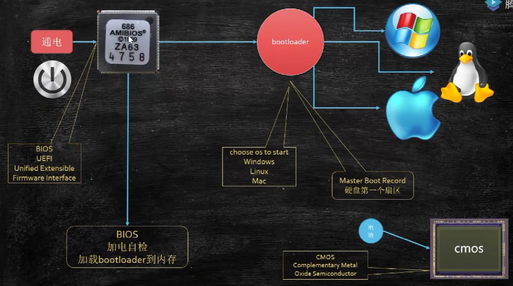
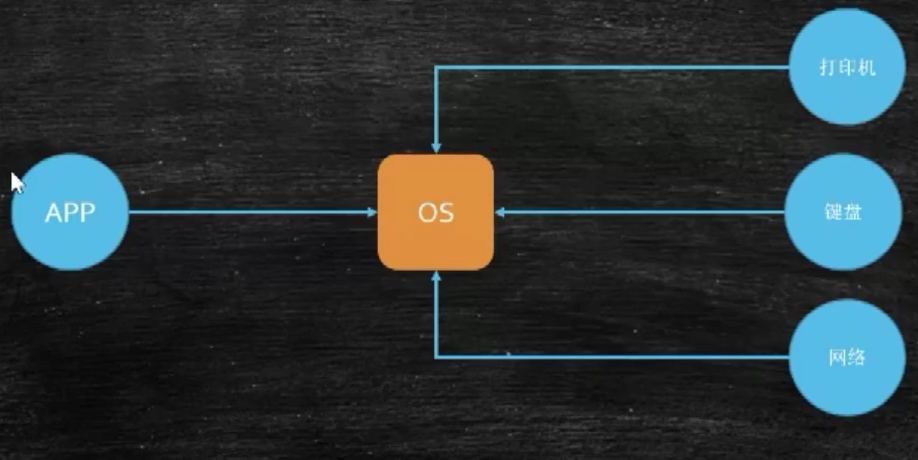
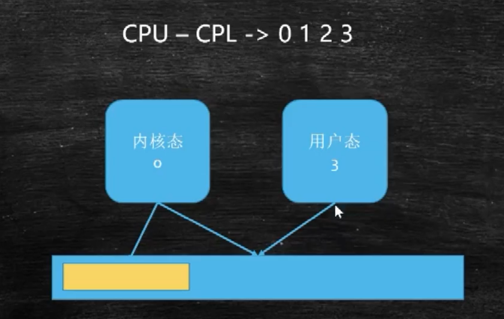
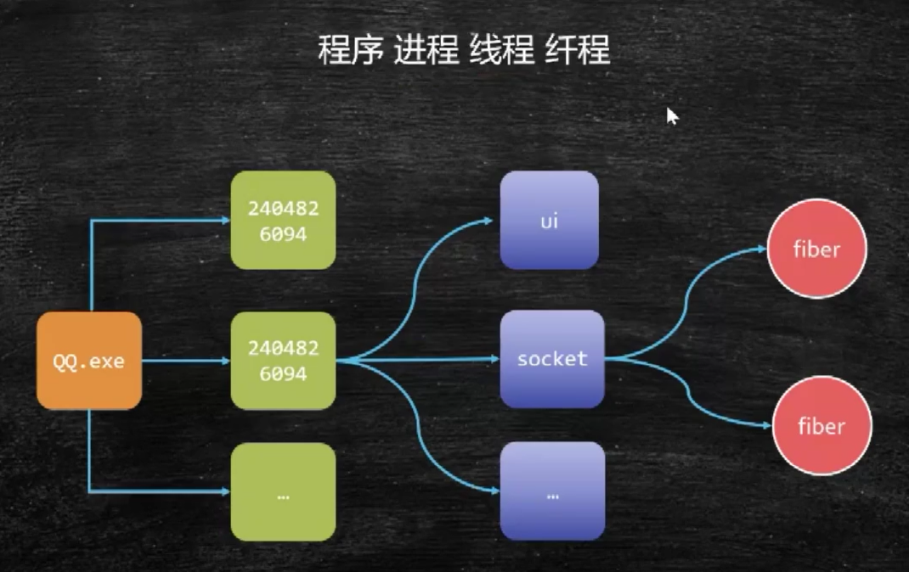
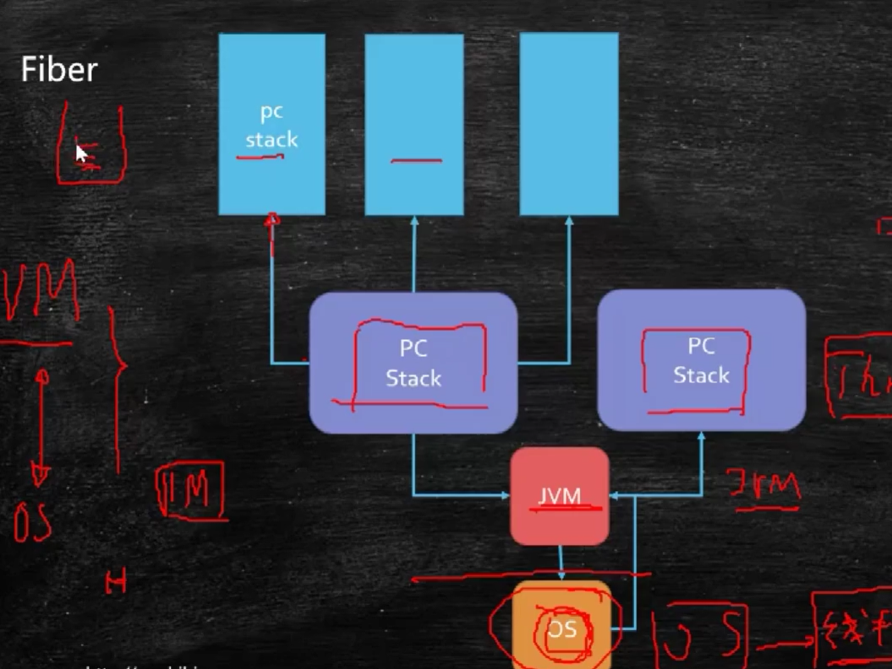

# 操作系统

## 内核

- 宏内核
- 微内核

## 开机

- cmos => CMOS是Complementary Metal Oxide Semiconductor（互补金属氧化物半导体）的缩写。它是指制造[大规模集成电路](https://baike.baidu.com/item/大规模集成电路)芯片用的一种技术或用这种技术制造出来的芯片，是电脑主板上的一块可读写的RAM芯片。因为可读写的特性，所以在电脑主板上用来保存BIOS设置完电脑硬件参数后的数据，这个芯片仅仅是用来存放数据的。
- bootloader => Bootloader是嵌入式系统在加电后执行的第一段代码，在它完成CPU和相关硬件的初始化之后，再将操作系统映像或固化的嵌入式应用程序装在到内存中然后跳转到操作系统所在的空间，启动操作系统运行

## 中断

## 内核态和用户态

0的级别最高
3的级别最低
操作系统是0级,可以做任何操作,
用户程序是3级,只能访问自己的内存,其他操作要通过0级的操作系统

- 进程:运行时会分配内存空间
- 线程:使用进程的内存空间,必须经过操作系统
- 纤程(协程/绿色线程):在用户空间模拟线程,不用经过操作系统
- 

进程分资源,线程执行

### 纤程为什么比线程快?

每一次创建线程都要经历以上一堆任务

