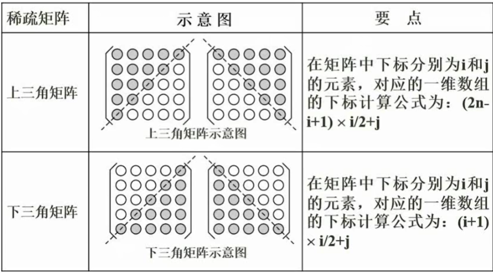

# 数据结构与算法基础知识点

## 数组

按行存储与按列存储：其实按行与按列都是一样的,只是有人不习惯先恒再竖，所以表现起来不太一样，完全可以改成自己习惯的样子

例如：二维数组`a[m][n]`
按行存储的话`a[i][j]`在哪？`a+(i*n+j)*len`
只要把m&n反过来，就变成了按列存储
按列存储的话`a[i][j]`在哪？`a+(j*m+i)*len`

## 稀疏矩阵

做题方法：特殊值法

## 线性表

顺序表：开辟连续的存储空间

链表内容：

	- 指针
	- 数据

链表分类：

-   单链表：单向
-   循环链表：构成一个环
-   双向链表：可以双向移动

## 顺序存储与链式存储

## 队列与栈

## 广义表

## 树与二叉树的基本概念

